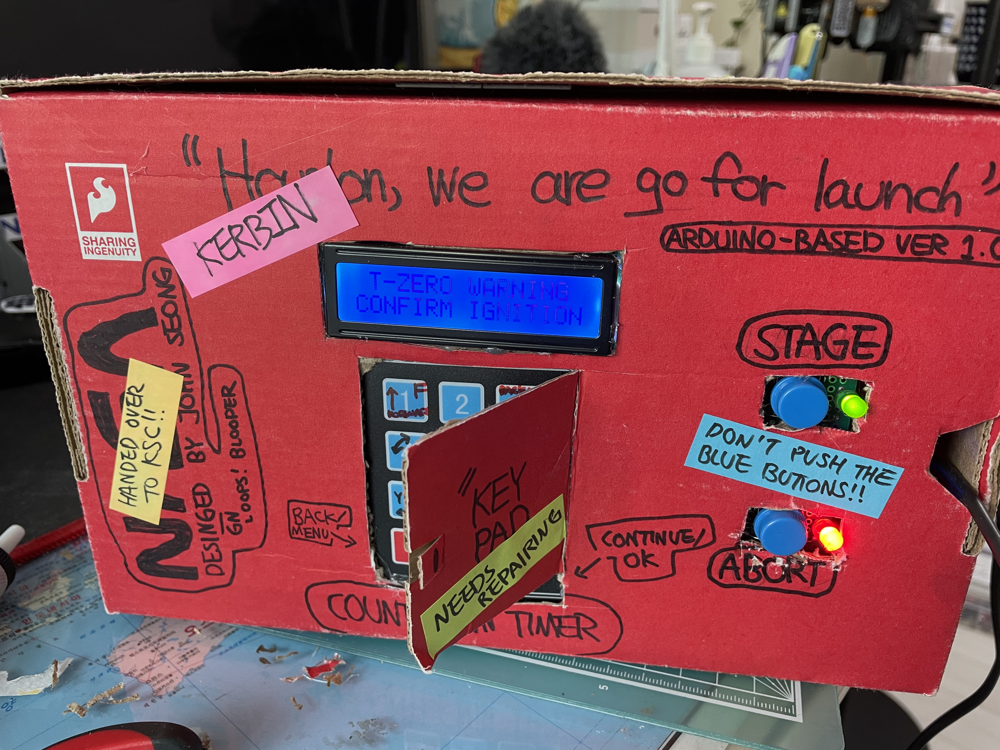
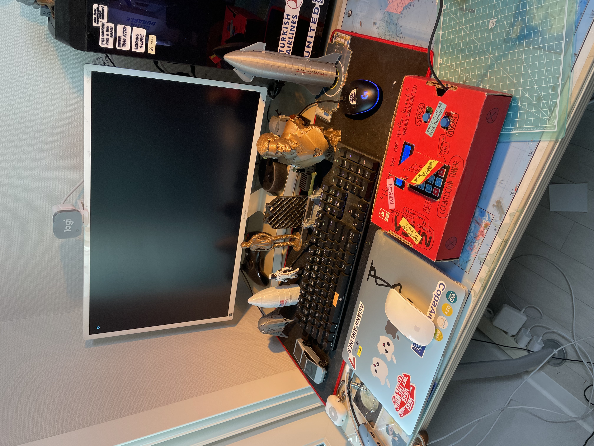
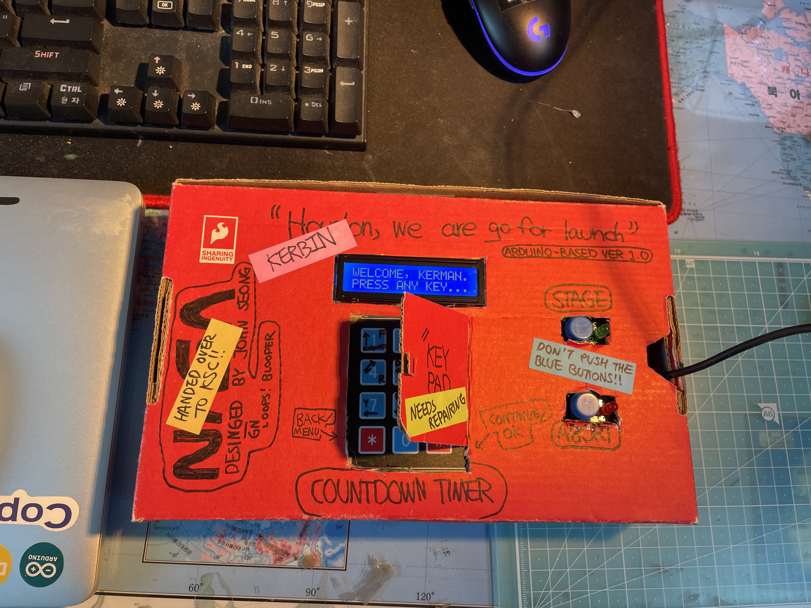
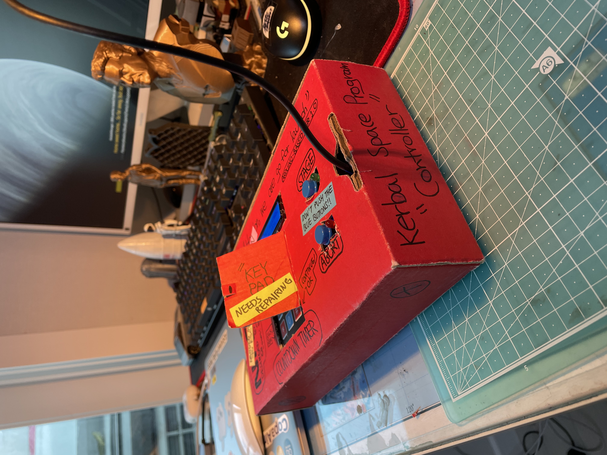

# Jebs-LCS-for-KSP
Jebediah's Launch Control System for Kerbal Space Program | Version 2.0 | An Open-Source Project by John Seong

*DESCRIPTION* | An automated countdown timer, a macro keyboard, and a control device for Kerbal Space Program that can be connected to the PC and autonomously launch the vehicle when the timer hits 0.

*FEATURES*
1. Automated countdown & launch
2. RCS & Throttle control
3. Simple thrust-to-weight ratio calculation

*YOUTUBE VIDEO* | https://www.youtube.com/watch?v=pBAoYTu1grg

*PICTURES*

